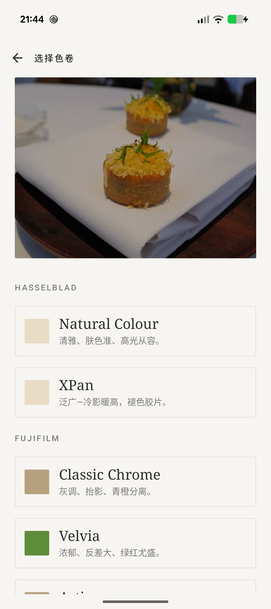
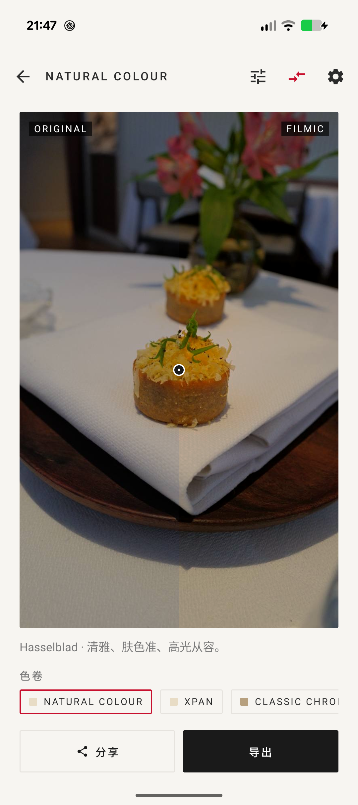

# Filmic

Android photo styling app — applies color grades inspired by **Hasselblad**, **Fujifilm**, and **Leica**. Edit from the gallery, shoot with a live LUT, or batch-convert.

<p align="center">
  
  
  
</p>

<p align="center"><em>Home · Style selection · Compare slider (drag to reveal original)</em></p>

## Features

### Import
- **Single photo** — Android PhotoPicker (no permissions prompt)
- **Camera** — CameraX viewfinder with the selected style applied live; shutter restyles the captured JPEG at full resolution
- **Batch** — pick up to 50 photos, apply one style to all, per-tile progress

### Preview
- Weighted preview fills the available height; letterboxing only where the image demands it
- **Compare slider** — drag a handle to reveal the original under the processed image
- **Adjust panel** — Lightroom-style Tone and HSL tabs
  - **Tone**: exposure (±2 EV), contrast, saturation, temperature, tint
  - **HSL**: 8 colour bands (red, orange, yellow, green, aqua, blue, purple, magenta) × hue/sat/lum
- Sliders drive a downsampled preview (≤1600 px long edge) for live response; export re-processes the full-res source
- Share sheet and Save-to-gallery both respect current style + adjustments

### Export settings
- JPEG quality 60–100 (default 94) — affects Save, Share, Camera capture, and Batch
- Output size: original, 4000 px, 2000 px, or 1000 px (long edge; aspect preserved)
- Persisted via `SharedPreferences` so choices survive relaunch

## Styles (9 built-in)

| Brand | Name | Engine | Description |
| --- | --- | --- | --- |
| Hasselblad | Natural Colour | matrix | 清雅、肤色准、高光从容 |
| Hasselblad | XPan | cube | 泛广—冷影暖高，褪色胶片 |
| Fujifilm | Classic Chrome | matrix | 灰调、抬影、青橙分离 |
| Fujifilm | Velvia | matrix | 浓郁、反差大、绿红尤盛 |
| Fujifilm | Astia | cube | 柔和、肤色温润、淡彩 |
| Fujifilm | Acros | matrix (mono) | 细腻黑白、微粒精致 |
| Leica | Standard | matrix | 克制、微暖、层次见内 |
| Leica | Chrome | cube | 浓郁反差、暖中冷影、红更沉 |
| Leica | Monochrom | matrix (mono) | 黑白、深黑、银盐颗粒 |

Matrix styles run through `ColorMatrix` + per-pixel tone curve. Cube styles load a 17³ `.cube` LUT from `assets/lut/` and sample via CPU trilinear interpolation — that's what lets them do split-toning, S-curves, and selective desaturation that a 3×4 matrix can't express. The three bundled cubes are generated programmatically in `tools/gen_luts.py`-style math (not calibrated from real camera pairs yet).

## Color pipeline

```
source bitmap
     ↓
[ style ]  ─ matrix path: ColorMatrix → tone curve → optional grain
           └ cube path:   3D LUT trilinear sample  → optional grain
     ↓
[ adjustments ]  exposure → contrast → temp/tint → global sat → per-band HSL
     ↓
display / export
```

## Stack

- Kotlin 2.0 · Compose BOM 2024.09 · Material 3
- Navigation Compose
- CameraX 1.4 (core / camera2 / lifecycle / view) — 16 KB page-aligned native libs for Android 15
- androidx.exifinterface (EXIF orientation)
- Coil (thumbnails)
- FileProvider for share intents
- `android.packaging.jniLibs.useLegacyPackaging = false` — ships `.so` files uncompressed and page-aligned

## Build

```
./gradlew :app:assembleDebug
```

Requires JDK 17 (bundled with recent Android Studio). Gradle 8.9 wrapper included.

## Roadmap

- [ ] GPU shader path for 3D LUT sampling (currently CPU only; limits camera preview FPS)
- [ ] Calibrated LUT packs from real camera sample pairs
- [ ] Brand-specific grain profiles on all styles (currently only monochrome)
- [ ] Tone curves panel (point-curve editor, not just the built-in shadow lift / highlight roll)
- [ ] RAW (.dng) support
- [ ] Style presets saved with user adjustments baked in
